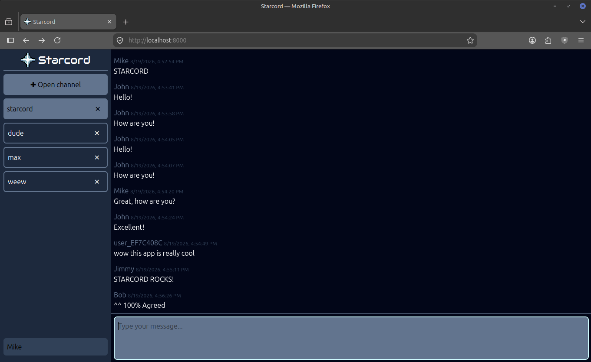

# 🐍⚡🚀 Viperlith: the hypermedia based monolith for Python

## Introduction
A demo application to illustrate how [Datastar](https://data-star.dev/) works.

`datastar.js` is a lightweight (11kB) hypermedia framework [similar to HTMX (but not)](docs/HTML_STREAMING.md).

A Discord-like chat sample application is currently implemented with real-time chat rooms, creating/removing channels and setting nicknames.

Live demo: https://starcord.fastserial.com

## The Stack
Viperlith consists of the following components:
1. [Litestar ASGI framework](https://litestar.dev/): Uses up to [10x less memory as compared to FastAPI](https://github.com/kunesj/fastapi-litestar-memory-benchmark).
2. [uvicorn](https://uvicorn.dev/): Popular ASGI web server
3. [MsgSpec](https://msgspec.dev/): Provides the same validation capabilities as [Pydantic](https://pydantic.dev/docs/validation/latest/get-started/) while [serializing an order of magnitude faster](https://msgspec.dev/benchmarks).
4. SQLite through [APSW](https://github.com/rogerbinns/apsw): Local SQLite offers minimal operational overhead, and when properly tuned, significantly outperforms Postgres & MySQL for most workloads. APSW provides better control, features and error handling compared to Python's builtin `sqlite3` module.
5. [Jinja templates](https://jinja.palletsprojects.com/en/stable/): Templating engine used to render HTML templates.
6. [Tailwind CSS](https://tailwindcss.com/): For declarative styling directly inside the markup.
7. Brotli compression: Used in Litestar's `CompressionConfig` to minimize bandwidth for streaming HTML over the wire.
8. [spsc-ring-threadsafe](https://pypi.org/project/spsc-ring-threadsafe): A ring buffer C extension for inter-process communication on shared memory, up to 100x faster than the standard library's `multiprocessing.Queue`. Used to queue commands to the single-writer process with exclusive write access to SQLite.

## Architecture
Hypermedia-driven applications (HDA), unlike SPA frameworks (e.g. React, Vue, Angular), **eliminate state and logic on the client side**. Instead, interactive logic is moved to the backend and page updates are streamed to the client as server-rendered templates over a Server-Sent Events stream and *morphed* into the local DOM.
This is a bit like streaming a movie, except the movie is HTML and you receive new content from updates and UI interactions. The client's browser is effectively reduced to a rendering viewport only capable of displaying raw HTML.

See [docs/HTML_STREAMING.md](docs/HTML_STREAMING.md) for an introduction to the concept of HTML streaming.

Also see: [the Tao of Datastar](https://data-star.dev/guide/the_tao_of_datastar)
and [Datastar: Why another framework?](https://data-star.dev/essays/why_another_framework).

## Quick Start
### 1. Copy `.env.example` and name it `.env`
	cp .env.example .env

Generate a `SESSION_KEY` with `openssl rand -hex 16` and change configurations if necessary.

### 2: Create directory for database file in `/var/lib`
	sudo mkdir -p /var/lib/viperlith
	sudo chown $USER /var/lib/viperlith

### 3: (Optional) Enable launch script permissions
	sudo chmod +x ./launch.sh

### 4: Run the launch script
	./launch.sh

This will launch the application in debug mode with hot reload.

Alternatively, it is possible to launch in production mode with multiple workers:
	
	DEBUG=0 ./launch.sh

## Deploy
Before running compose, make sure environment variables such as `SESSION_KEY` are present in the shell environment by configuring them in CI. These will take precedence before the defaults inside `.env.example`.

	docker compose --env-file .env.example up --build

By default, the application will bind to localhost on `127.0.0.1:8000`. The application will only be accessible from the internet if you have a reverse proxy with an appropriate `proxy_pass` pointed there. If you have a different setup, edit the compose config as needed.

## Tuning
Disable block device readahead to reduce excess page faults in larger-than-RAM datasets (see block devices with `lsblk`):
	
	sudo blockdev --setra 0 /dev/nvme0n1

## Credits
Inspired by Anders Murphy's [Hyperlith](https://github.com/andersmurphy/hyperlith).