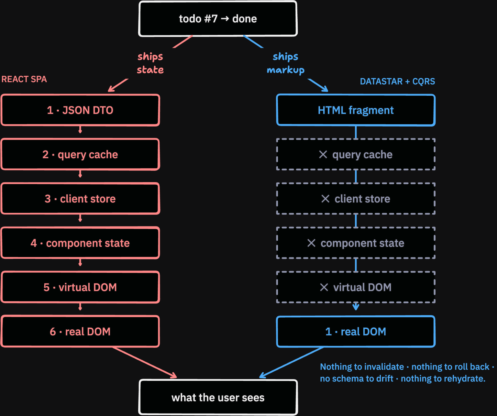

# Why HTML Streaming is the Future of the Web
## Introduction
`datastar.js` is a lightweight (11kB) hypermedia framework similar to HTMX, but with a different view on server architecture, favoring CQRS, **HTML streaming** and Server-Sent Events. "push" events as opposed to client-side polling with request-response cycles.

Viperlith is a small and opinionated full stack [Datastar](https://data-star.dev/) web application monolith written in Python, encapsulating these ideas. It can be used as a template or reference architecture. A Discord-like chat sample application is currently implemented which allows real-time chat rooms, creating/removing channels and setting nicknames.

Most SPA frameworks (e.g. React, Vue, Angular) expose JSON endpoints on the server, then render the page on the frontend with JavaScript & reactive components. Hypermedia Driven Applications (HDA) instead render HTML markup on the server and then send it to the client to update (parts of) the screen.

Hypermedia streaming makes it possible to build rich interactive user experiences just using HTML, without requiring (heavy) JavaScript SPA frameworks, resulting in application that perform better and are generally simpler to build and maintain.

This page will explain the concept of HTML Streaming and why it is the future of web development.


## Terminology
- **HTML**: HyperText Markup Language
- **HDA**: Hypermedia-Driven Applications
- **REST**: REpresentational State Transfer
- **SPA**: Single-Page Application
- **MPA**: Multi-Page Application
- **DOM**: Document Object Model (representation used internally by the browser for web pages)
- **morph**: merging a fragment of HTML into the DOM
- **SSE**: Server-Sent Events
- **SSR**: Server-Side Rendering
- **templating engine**: Tool for dynamically building string output, used to 'render' HTML responses
- **CQRS**: Command Query Responsibility Segregation
- **ACID**: Atomicity, Consistency, Isolation & Durability


## Datastar vs HTMX
[HTMX](https://htmx.org/) is a great library that inspired many people in the web development world to reconsider what is possible. However when building larger applications with HTMX, it has some inherent complexity that builds up over time. So what are the problems?

### Problem #1: Client-side variables (or lack thereof)
Experience shows that even for server-rendered apps, you still want some client-side interactivity. For example, having to send a network request just to show a dropdown menu is undesirable. However, HTMX provides very little in the way of this, meaning you need to pull in additional JavaScript libraries such as [Alpine.js](https://alpinejs.dev/). While lightweight, they introduce new syntax and APIs. Also, Alpine stores state outside the DOM that [doesn't always play well with HTMX](https://youtu.be/SjUoc8R1dzQ?si=mGA4nkLOCs49cAje&t=1431), sometimes causing conflicts when updating real elements on the page. There is now an [HTMX-Alpine compatibility extension](https://four.htmx.org/extensions/hx-alpine-compat) that somewhat improves the situation, but still it isn't ideal.

Datastar instead ships with **signals** built-in. They can be thought of as client-side state objects similar to `x-data` in Alpine. Through a lightweight set of [attributes](https://data-star.dev/reference/attributes), it is possible to build declarative client-side expressions for a wide range of interactivity (showing/hiding dropdowns, menus, search filtering etc.), meaning you need just a single script instead of two (Datastar (11 kB) vs HTMX 4.0 (11 kB) + Alpine (13.4 kB))[^3]. But the greatest advantage is better integration. By default, Datastar includes all client-side signals in every request. Every stateful component on the page can be mapped to a JSON value, and now your backend will be automatically aware of it. This makes common patterns like form submission trivial. But also, you can send a JSON response from the server and patch client signals directly. In general, it is hard to overstate the desync issues that this removes.

### Problem #2 (the big one): Polling Instead of Push
But there is a more fundamental difference: HTMX relies on request-response interactions with partial HTML-fragments "patched" into the DOM. Remember: your backend returns HTML not JSON. This means that most interactions consist of page fragments requested from the server, each one returning an HTML template patched in place.

However, this creates a problem of "patchwork". HTMX allows requests to be sent on any regular event (`input`, `click` etc.) via `hx-trigger` or using timers: `hx-trigger="every 1s"`. However when your UI updates consists of these different triggers, questions arise; namely, which parts do you update, and when? You swap one fragment, then another part of the page might have just become stale, showing outdated information. How do you coordinate which updates to send?


## Out-of-Bounds Swap: The Eureka Moment
Seasoned HTMX developers found a powerful solution: `hx-swap-oob`. The out-of-bound swap: this attribute is almost magical in how well it solves the problem. Here's how it works: Your HTML fragment no longer gets patched into just one place. Normally, you would set an `hx-target="#some-div"`, then the server response would be inserted **exactly there**. However, `hx-swap-oob` turns this around: `hx-target` is completely ignored, and now **the element itself decides where it gets inserted**.

An element like this:
```html
<div id="alerts" hx-swap-oob="true">
    Saved!
</div>
```
Will replace wherever the `#alerts` element is on the page. Wherever it may be!

When developers working on a mid to large HTMX codebase discover `hx-swap-oob`, invariably they start using it more. So much so, that eventually entire pages consist of elements swapped out-of-bounds. So why exactly is this feature so powerful?

The reason has to do with the earlier stated problem: what part do you update on the page? First, notice how the server is now in control: by setting the `id` of the out-of-bounds element, the server can target exactly where the update takes place. Or in other words: **the server controls the view**.


## `view = f(state)`
The core of any interactive application can be expressed in a single formula:
```
    view = f(state)
```
The 'state' refers to the application state. The 'view' refers to the representation of that state, communicated to the outside world for humans.

For hypermedia-driven applications:
- **The state**: should be persisted on disk and therefore is stored in a database such as SQLite, Postgres or MySQL.
- **The view**: is an HTML string, exposed over a network API which is rendered by the client's browser.
- `f()`: is a rendering function which takes in the server state (DB) and outputs an HTML string. On the backend, this is done by combining SQL queries with a templating engine such as Jinja in Python or Templ in Go.


## Coming Back to `hx-swap-oob`
When the server controls the view, it can now do something clever: it can update the stale parts on the screen and ignore the rest. There is no limit to how many `hx-swap-oob` elements can be included in a response; one, two, three, five, or every element on the page. There is no limit.

Previously, your backend needed one API endpoint for every HTML fragment. Now, you just need a single endpoint: `/page/updates`.

Your client can call this endpoint whenever and however many times it wants. Every time, the server will respond exactly with the right number of `hx-swap-oob` fragments so that you are fully up-to-date. Call the endpoint, and you're caught up! No more patchwork and manual fragment soup, or worries about outdated information on the page. The server has your back.


## Datastar: Out-of-Band By Default
In Datastar, responses are always out-of-band by default. For many HTMX users, this is very confusing as there is no `hx-target`. Looking at just the HTML markup, you cannot tell exactly what is going on.

**And this is by design**: HTML is just a declarative markup of whatever should currently be displayed on the screen. It does not control the view, **because the server controls the view**.

Datastar allows you target individual elements by `id` like HTMX. Heck, you can even [emulate the entirety of HTMX in Datastar](https://github.com/starfederation/datastar/issues/1190).

Previously, when inserting partial HTML fragments, parts of the page would show stale data when updated by different events at different intervals. However, Datastar encourages something radical: **just replace the entire page**.

Finally, no more fragments. No more partials. Every. Request. Rebuilds. The. Entire. Page; from a single `render()` call on the backend. Full-page rebuilding eliminates most desync problems. Because everytime you rebuild, you are up to date. No ifs or buts. This is similar to [immediate mode rendering](https://en.wikipedia.org/wiki/Immediate_mode_(computer_graphics)) in the graphics world.


## Full Page Rebuilds? No Way
The server will send the entire page as HTML in a response (specifically the `<body>` tag). Yes, **the entire page**. So what? It's just a string. If you are scared of doing this, then close this page and go back to using React.

> Now I have te rebuild my entire page on every tiny change? Are you out of your mind? Do you know what that costs me? Cloud credits don't grow on trees you know?

Oh you're still here? Unfortunately, a lot of developers are scared of doing this and bring up performance as a concern. First: have you actually measured and found it to be a problem?

To understand Datastar's approach, the [Tao of Datastar](https://data-star.dev/guide/the_tao_of_datastar) is a great starting point. Datastar was born out of a desire for performance and sanity, by someone who was not traditionally a web developer. Therefore, the performance question is answered as follows: If your server is too slow to render a view for every update, then your architecture is wrong. There is nothing fundamentally preventing you from building a system that produces a template in a reasonable amount of time. Unfortunately, the industry has a habit to buy into complex solutions that "scale", usually by layering more services and gluing them together. As an example, here is the ["References architecture" for Worpress on AWS](https://docs.aws.amazon.com/whitepapers/latest/best-practices-wordpress/reference-architecture.html). Wordpress mind you, a static site CMS. Each service adds more latency, more overhead and more headaches. To be completely truthful, 97% of CRUD apps can run on a Linux box running a binary with SQLite. The "Just use Postgres" meme should really be "Just use SQLite".

**Coming up: How CQRS combined with SQLite supercharges your database performance to new heights**

Whatever your current interpretation is, you might need to re-calibrate your intuition about database performance. For starters: [SQLite can reach over a million inserts per second](https://andersmurphy.com/2026/06/05/the-perils-of-uuid-primary-keys-in-sqlite.html) and scales near-linearly with core count for read queries. The primary techniques employed are fast local NVMe storage (directly slotted in the motherboard, no SAN networked storage that every cloud vendor sells you), batched transactions and **having only a single writer** (more on that later). All of these factors combine in a non-linear ways to achieve a level of performance that far exceeds most people's expectations. Most gains are achieved by placing the data close to where it is needed.

To summarize, full-page rebuilds are faster than you think, provided your database and web server are also fast, which they should be.

So that addresses the server-side, but what about the client?


## The Magic Sauce: Idiomorph
[Idiomorph](https://github.com/bigskysoftware/idiomorph) is a sophisticated DOM-morphing algorithm written in JavaScript, of which Datastar uses its own adapted implementation. This algorithm takes any fragment of HTML and *morphs* it into the local DOM, replacing or inserting content on the page. It is possible to target individual elements, or morph the entire page at once.

Practically, this means we no longer have to care about partial rendering or diffing for performance reasons. The server can send the **entire page** at once (known as a "fat morph"), and the algorithm on the client will only touch the real DOM where it needs to change. This allows us to render the whole page from a single function (`view = f(state)` aka `html = render(DB)`) on the backend, and simply re-render when the state (DB) changes. No manual diffing or VDOM required.


## Practically Cheating: Brotli Compression
Oh, but you are concerned about network bandwidth? That which your cloud vendor bills you very heavily for? Well, use of persistent SSE streams enables **streaming compression** across an entire session compared to mere individual requests. Using the browser's built-in [Brotli compression](https://en.wikipedia.org/wiki/Brotli), extra bytes are sent over the wire only if the content is changed. This achieves total [compression ratio's of 58.5x](https://zweiundeins.gmbh/en/blog/spa-vs-hypermedia-real-world-performance-under-load#streaming-efficiency-sse-compression) and better, exceeding what is commonly attainable from gzipped responses.

Brotli is a compression algorithm similar to GZip or ZStandard, which is available by default in most browsers. It supports **streaming compression**, meaning we can compress HTTP responses "continuously" as they arrive. Crucially, the **compression context persists as long as a given response**. Meaning any data we send in a response can refer back and de-duplicate anything that came before it. Notice how well this synergizes with Datastar's encouraged use of Server-Sent Events and long-lived responses. Under the hood, this uses HTTP/1.1's [Chunked Transfer Coding](https://en.wikipedia.org/wiki/Chunked_transfer_encoding) or more efficient mechanisms for data streaming in HTTP/2.

Remember this:
- GZip: Compresses only individual responses, discards the compression window on every request
- Brotli streaming compression over SSE: keeps the compression window for the duration of the stream

An HTTP SSE response is kept open and we keep streaming HTML over it to the client. In practice, even when continuously re-sending the entire HTML page, no extra bytes are transmitted over the wire unless something changes. Over time, the bandwidth converges on only the **delta** of the page content. Idiomorph ensures we only touch the real DOM where necessary.


## Why Polling Is Bad
The out-of-bounds discussion has answered the question of "which parts do we update?". Answer: the entire page. Now we shift to "**when** do we send updates?".

Let's attack some underlying assumptions first. Namely, who is in charge of page updates?
1. **The client**: should it poll the server for information?
2. **The server**: "push" updates to the client as they become available

Spoiler alert: **The answer is 2**

To understand why, consider this: Who owns the application state? The answer of course, is the server. This is also the party who knows when it is appropriate to send an update i.e. if the application state changed. It owns the state, so therefore it knows. The client doesn't "know" anything. It just connected via a URL and received a "view" in the form of a webpage.

It sounds simple: only send when you actually have something to send. But it's also more efficient in terms of network traffic, battery life and latency. When an update occurs, you can send it immediately. No need for a client to poll and "find out" that a resource has become outdated.

So how to push? That is the question. There happens to be a great mechanism in the browser that we can use for this: **Server-Sent Events**.

This brings us to...


## Why Server-Sent Events?
### First of all: What are Server-Sent Events?
To understand SSE, it is recommend to first watch [this overview video](https://www.youtube.com/watch?v=xq1dVQ-isb4).

For the full version, see [the WHATWG spec](https://html.spec.whatwg.org/#server-sent-events).

Short answer: SSE is an HTTP response type: `text/event-stream`. Other HTTP response types include `text/html`, `application/json` and `multipart/form-data`. Those are for HTML, JSON and form data respectively.

So what does the body of an SSE response look like?

Answer:
```
event: datastar-patch-elements
data: selector body
data: mode outer
data: elements <body>
data: elements      <button>Click me</button>
data: elements </body>


```
It is mostly just text. But notice the particular format with `event:`, `data:` and the two trailing endlines `\n\n`? That is part of the SSE response format.

### What SSE is NOT
SSE is NOT connection type, it's actually **just HTTP** ([watch the video](https://www.youtube.com/watch?v=xq1dVQ-isb4)).

Another misconception: SSE is *always persistent*.

An SSE response can keep contain one chunk, or multiple. The server can keep sending data as long as it wants, as it is in control of when the response ends.

### So Why use SSE?
Because it **places the server in control of when data is sent** (push vs pull). Additionally, it synergized well with native browser functionality, such as Brotli streaming compression as discussed.

Datastar encourages a "push" model with full-page rebuilds similar to [immediate mode rendering](https://en.wikipedia.org/wiki/Immediate_mode_(computer_graphics)). These full page updates (known as "fat morphs") are sent directly to the client, replacing the entire contents of the screen at once. Server-Sent Events work exceptionally well in this model. Of all the tools available in the browser, this one emerged as a winner.


## Why not web sockets?
In practice, web sockets are a rarely a good choice. HTTP handles a lot functionality "for free" (compression, stateful connections, multiplexing, etc.), all natively in the browser (in C++). But with web sockets, applications must handle all of that themselves on the main thread in JavaScript. This is not only a lot overhead to manage yourself, but it also competes with everything in JavaScript performance-wise.

The author of Datastar has done just about everything to make web sockets work, but here's the TLDR: **it's a dead end and not worth it**. There you go, you can save yourself a lot of time. Feel free to [Donate](https://data-star.dev/star_federation) to the Star Federation – a 501(c)(3) nonprofit organization behind Datastar for every hour saved.


## Just use HTML
The [htmx essays](https://htmx.org/essays/) have done most of the work already and you should not need convincing on this. But anyways, here we go.


### Client-side state management
One of the more complex ongoing problems in the SPA world is the management client-side state. Many solutions exists (Redux, Zustand, React Router).
Hypermedia-driven applications deal with this problem cleverly: **by eliminating client-side state** (and moving it to the backend). Without client-side state, there is no need to manage it. [Incredible!](https://i.giphy.com/1pA2TskF33668iVDaW.webp) For the vast majority of applications, a web client never "owns" the state of a resource. Instead, the server owns the state, and the client sees a view.

Of course, not all client-side state can be eliminated. Some of it is necessary, such as user inputs, scroll position etc. Also, some state is considered *trivial*, meaning it does not affect anything meaningful. For example, whether dark mode is enabled or a dropdown menu is opened are mostly client-side visual artifacts that do not concern the server.

The result of eliminating client-side state is that the browser becomes a "dumb" viewport or terminal, capable only of displaying HTML.

### Obsoleting of the Virtual DOM
In the SPA world, the "virtual DOM" or "vdom" *Raison d'être* was to support fast dynamic page updates such as real-time updating of table data, because browsers at the time struggled with this, especially on low-end client hardware.

However, a lot has changed since 2013 and browsers have become a lot more capable. Meanwhile, internet speeds improved dramatically while hardware became more powerful. We can now rely on the **real DOM** to represent and update the page directly, without recreating the world in JavaScript. That is of course, given that we do not apply updates naively. Thanks to approaches like Idiomorph, this is now a solved problem.

Consider that many of the more performance-sensitive routines in the browser (parsing HTML, layout engine, font sizing, etc.) are highly optimized through decades of engineering and are written in native languages such as C++, compiled for the target hardware. At its core, the browser is an engine purpose-built to render HTML. Meanwhile, JavaScript is a scripting language in a JIT runtime demanding high amounts of memory and startup times. Thanks to billions of dollars of investment by parties like Google, it is not as slow anymore as it once was. However, it will always be slower than native code. Also, the single-threaded model of JavaScript where rendering blocks the main thread and vice-versa has aged especially poorly into the multi-core era. Meanwhile, the browser is taking full advantage of multithreading to parallelize other work. Let's lean into that if we can, ok? Trying to beat the browser's native code in a scripting language is, well, an uphill battle at the very least.


## A Complete Picture
So far we have talked in somewhat abstract terms about state, updates, compression and morphing. What does an actual concrete web server look like with Datastar?

Here is the mandatory client-server diagram, with the server on top:
```
                                                                  
                    Datastar Server Endpoints                     
                                                                  
   ┌──────────────────────────────────────────────────────┐       
   │                                                      │       
   │                 Web Server + database                │       
   │                                                      │       
   └──────────────┬───────────────────────────────────────┘       
             ▲    │                 ▲               ▲             
             │    │                 │               │             
             │    │                 │               │             
    GET      │    │ HTTP SSE        │ POST          │ POST         
    /updates │    │ response        │ /button-click │ /form-submit 
             │    │ (kept open)     │               │             
             │    │                 │               │             
             │    ▼                 │               │             
   ┌─────────┴──────────────────────┴───────────────┴─────┐       
   │                                                      │       
   │                     Client browser                   │       
   │                                                      │       
   └──────────────────────────────────────────────────────┘       
                                                                  
```
Having the ability to render any HTML through templates, what do we need state on the client for? We can keep all state in the backend and simply send down the declarative HTML for what the client is supposed to see at any given moment over SSE. This drastically simplifies the picture on the client.

To give an idea for the sequence of events:
1. The client connects for the first time, requesting the stream via `/updates`.
2. The server responds with the `text/event-stream` response type, and `Connection: Keep-Alive`, meaning the connection stays open.
3. The server continuously "pushes" an update of the screen over the SSE stream, anytime a resource on the server changes, necessitating a re-render.
4. During this time, the client may be able to interact with the server via buttons etc. These send regular short-lived POST requests.

Notice that the page content is always delivered over the single SSE stream that is kept open. The POST endpoints such as `/button-click` usually respond with a `204: no content`.


## Client-side State in React
Now compare this with the story for client-side state in React:



What a breath of fresh air! Relying on the browser for most functionality is not only viable, but in fact faster and more reliable than trying to recreate everything in JavaScript.


## Relying on HTML for UI components
Relying on HTML extends not only to DOM updates, but also to UI components. HTML5 has acquired many native features such as datetime pickers, dialogs and more. We can use this instead of building our own. Some examples of UI component libraries that do this are [BasecoatUI](https://basecoatui.com/), [KelpUI](https://kelpui.com/) and [DaisyUI](https://daisyui.com/).


## Simple Web Server Architecture
We have discussed a lot about Datastar on the client. Now let us address the server side. We will work our way up from a simple web server, all the way up to a CQRS architecture used by Viperlith.

A simple web server + database might look like this:
```
                                           
        Simple Web Server + Database       
                                           
              ┌─────────────┐              
              │  Web Server │              
              │             │              
              └──────┬──────┘              
                     │                     
                     │ Read/Write          
                     │                     
   ┌─────────────────┴─────────────────┐   
   │                                   │   
   │         Postgres or MySQL         │   
   │                                   │   
   └───────────────────────────────────┘   
                                           
```
All is well, but if we have many users, traffic increases and our web server running on a single thread could get overloaded, especially if it is written in a scripting language such as Python or JavaScript.


## But... We Can Raise an Army of Workers Right?
To solve this, many web servers provide an option to run multiple workers, which will spawn either threads or processes to run in parallel:
```
                                                           
          Web Workers + Database Architecture              
                                                           
   ┌───────────────────────────────────────────────────┐   
   │                uvicorn --workers N                │   
   │                                                   │   
   │ ┌─────────────┐  ┌─────────────┐  ┌─────────────┐ │   
   │ │  Web Worker │  │  Web Worker │  │  Web Worker │ │   
   │ │      1      │  │      2      │  │      N      │ │   
   │ └──────┬──────┘  └──────┬──────┘  └──────┬──────┘ │   
   └────────│────────────────│────────────────│────────┘   
            │                │                │            
            │ Read/Write     │ Read/Write     │ Read/Write 
            │                │                │            
   ┌────────┴────────────────┴────────────────┴────────┐   
   │                                                   │   
   │                 Postgres or MySQL                 │   
   │                                                   │   
   └───────────────────────────────────────────────────┘   
                                                           
```
Each worker is stateless and receives a separate read/write connection to the database.

Great! We scaled web workers across the machine's core count.

However, we have now acquired a new bottleneck: **The database**.

Notice how each web worker has its own read/write connection to the database? Each worker is competing to schedule transactions. And because each transaction could be reading and writing to/from the same rows, the database has to coordinate this in an orderly fashion while maintaining **ACID**.

In particular:
- What happens if two workers try to edit the same row simultaneously?
- When do a worker's writes become visible to other workers?

The database has to ensure that each query sees a consistent, isolated view of the data, while making sure that changes are atomic.

From the user's perspective, it "just works" and the database seems to handle it fine. However, maintaining strong ACID guarantees does not come for free. Most databases hold **locks** when a particular piece of data is being modified. While the lock is held, **no other query can modify the same data protected by the lock**. This locking can lead to **contention** and performance problems under load.

Counter to popular belief, **Postgres is not ACID by default**. The default isolation level in Postgres 'read committed', which [allows for serialization anomalies, phantom reads and nonrepeatable reads](https://www.postgresql.org/docs/current/transaction-iso.html). To solve this problem, the isolation level must be set to 'serializable', however the documentation warns that:

> "applications using this level must be prepared to retry transactions due to serialization failures"

The story for MySQL is also not much better, with the default isolation level of 'repeatable read' [still allowing for serialization anomalies](https://dev.mysql.com/doc/refman/8.4/en/innodb-transaction-isolation-levels.html). Again, a 'serializable' level is available, however not without performance implications:

> InnoDB implicitly converts all plain SELECT statements to SELECT ... FOR SHARE

>  SELECT ... FOR SHARE
> Sets a shared mode lock on any rows that are read. Other sessions can read the rows, but cannot modify them until your transaction commits. If any of these rows were changed by another transaction that has not yet committed, your query waits until that transaction ends and then uses the latest values.

So while we can use multiple web workers, unless we are willing to compromise on ACID, we do not get the same scaling out of the database, as our concurrent transactions will be waiting to acquire locks.

What can we do about this?


## Switching to SQLite
First, we will switch our database to SQLite. An out-of-process databases such as Postgres has unnecessary overhead, such as:
- Running in a standalone process
- Localhost networking protocol + serialization
- Binary size
- Connection pooling
- Poor MVCC implementation[^1]
- File format portability
- If remote: TCP/IP + SSL/TLS
- Startup time

However, this will not actually solve the concurrency problem. If we simply copy the previous architecture, we will run into the infamous `SQLITE_BUSY` error.

So what to do?


## CQRS Architecture
CQRS, or "Command Query Responsibility Segregation" is really just a fancy way to say "separating reads from writes".

We will make a big change: web workers are themselves not allowed to write to the database. Instead, their connections are **read-only** and a separate 'single-writer' process holds **exclusive write access**. If a worker needs to affect a write to the database, it will place a command into the queue for the single-writer.

A "command" in this case means an "event to be processed by the single-writer". It could lead to a database write. Or not, depending on business logic. When a worker receives a request from a client, it will only validate the *shape* of the request. Workers themselves **DO NOT** process business logic. They simply enqueue commands for the single-writer to deal with.

This design effectively serializes all writes at the application layer, meaning `SQLITE_BUSY` is never encountered. Because workers read from the same `mmap` page cache, reads scale horizontally with core count without cache duplication. Writes can be batched for maximum throughput while still being fully serialized & ACID. The single-writer drains the queues and processes commands on a fixed frame rate i.e. interval. Batching makes it possible to reach as much as [a million inserts per second](https://andersmurphy.com/2026/06/05/the-perils-of-uuid-primary-keys-in-sqlite.html).

However, since each worker lives inside its own process, by default, they have no way of communicating with the writer's process. To solve this, we allocate the command queues in shared memory[^2] to enable inter-process communication. Viperlith uses my lockless ring buffer C extension which is [100x faster than the standard library's `multiprocessing.Queue`](https://pypi.org/project/spsc-ring-threadsafe/).
```
                                                                                        
                               Viperlith CQRS Architecture                              
                                                                                        
   ┌───────────────────────┐    ┌───────────────────────────────────────────────────┐   
   │ Single-writer Process │    │                uvicorn --workers N                │   
   │ ┌─────────────────────┴────┴─────────────────────────────────────────────────┐ │   
   │ │                               MPSC command queue                           │ │   
   │ │                               (shared memory)                              │ │   
   │ └─────────┼───────────┬────┬───────────▲────────────────▲────────────────▲───┘ │   
   │  ┌────────▼─────────┐ │    │ ┌─────────┼───┐  ┌─────────┼───┐  ┌─────────┼───┐ │   
   │  │  Business Logic  │ │    │ │  Web Worker │  │  Web Worker │  │  Web Worker │ │   
   │  └────────┬─────────┘ │    │ │      1      │  │      2      │  │      N      │ │   
   │           │           │    │ └──────┬──────┘  └──────┬──────┘  └──────┬──────┘ │   
   └───────────│───────────┘    └────────│────────────────│────────────────│────────┘   
               │                         │                │                │            
               │ Read/Write              │ Read           │ Read           │ Read       
               │                         │                │                │            
   ┌───────────┴─────────────────────────┴────────────────┴────────────────┴────────┐   
   │                                                                                │   
   │                            SQLite (mmap + WAL mode)                            │   
   │                                                                                │   
   └────────────────────────────────────────────────────────────────────────────────┘   
                                                                                        
```
A typical interaction cycle goes like this:
1. User performs an action inside the UI
2. Fetch request is fired to an action endpoint (e.g. `/click-button`)
3. Web worker receives the request, validates its format and places a command in the queue
4. Single-writer takes the command from the queue
5. Single-writer applies business logic
6. Single-writer commits a write-transaction to the database
7. The write becomes visible to all workers
8. The worker holding the SSE stream to the client re-renders the page, based on the new database state
9. Client receives the new page content and Datastar morphs it into their local DOM
10. Client sees the updated page

We now have obtained the following features:
1. Writes never block or run into locks
2. Readers and writer don't block eachother (ensured by WAL mode)
3. Readers scale horizontally with core count
4. No cache duplication / Readers read from the same page cache (ensured by mmap)
5. Batching unlocks further increased write throughput

Alas, we can increase worker count without running into concurrency problems!


## Finally! We can get back to building CRUD
If all of this sounded like a lot, you are not alone. Luckily, you can now get back to building CRUD in style.

To join a community of like-minded people enthusiastic about web, hypermedia, performance and databases consider [joining the Datastar Discord](https://discord.gg/bnRNgZjgPh).

That is all! I hope you enjoyed reading this. And remember: may your cloud bills be lean and your morphs be fat.


## LLM Usage Disclosure
No AI was used whatsoever in any part of this writing.


[^1]: Postgres' MVCC implementation [has aged quite poorly](https://www.cs.cmu.edu/~pavlo/blog/2023/04/the-part-of-postgresql-we-hate-the-most.html). Long-running transactions can block the autovacuum process, which leaves behind more dead tuples, which in turn slow down transactions in a vicious cycle until the database halts to a crawl.
[^2]: Shared memory [is the fastest way of communicating between processes](https://chengxin.de/2021/ipc/).
[^3]: Sizes compressed and minified